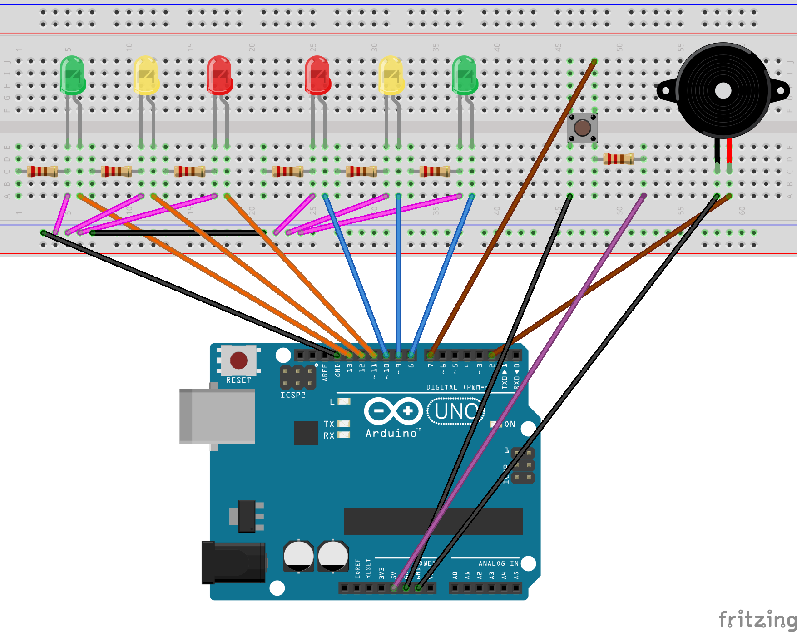

# Feux de circulation

- Année : M2 IWOCS
- Sujet : Docker

## Auteurs

|Nom|Prénom|
|--|--|
| *BOURGEAUX* | *Maxence*|
| *GUYOMAR* | *Robin* |

# Description

Ce projet Arduino propose une gestion manuelle de quatre feux de circulation dans un carrefour à l'aide d'un 
arduino uno et d'une page web générée par ExpressJS. L'utilisateur peut choisir d'alterner les feux soit par la websocket,
soit par l'Arduino via les boutons mis à disposition. Un son est produit après chaque changement de feux à l'aide d'un 
buzzer pour indiquer le changement aux personnes malvoyantes afin qu'elles puissent traverser la route en toute sécurité.

## Installation

On commence par installer les dépendances :

    npm i

On démarre MongoDB si ce n'est pas déjà fait : 

    sudo systemctl start mongod

Puis on lance le projet :

    npm start

Pour un problème de permissions de l'Arduino : 

    ls /dev/ttyACM0

    sudo chmod a+rw /dev/ttyACM0

## Schéma de l'Arduino Uno

### Composants

Voici la liste des composants utilisés pour réaliser ce projet :

* x1 Arduino Uno
* x2 Led vertes
* x2 Led jaunes
* x2 Led rouges
* x1 Bouton poussoir
* x1 Buzzer 
* x7 Résistances
* x19 Cables

### Schéma

Ce schéma a été réalisé via le logiciel Fritzing.

